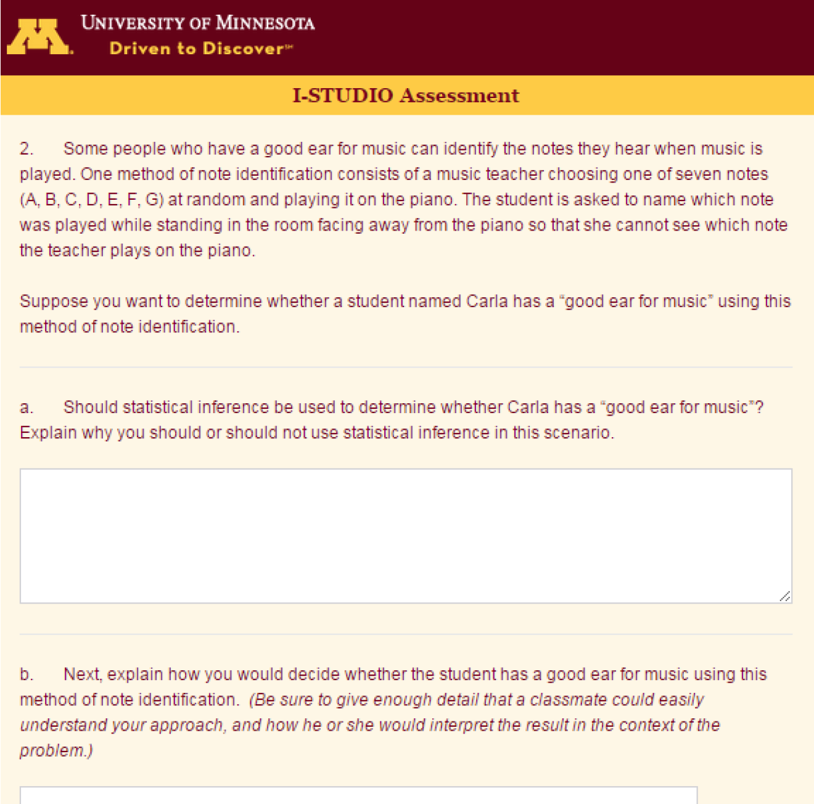
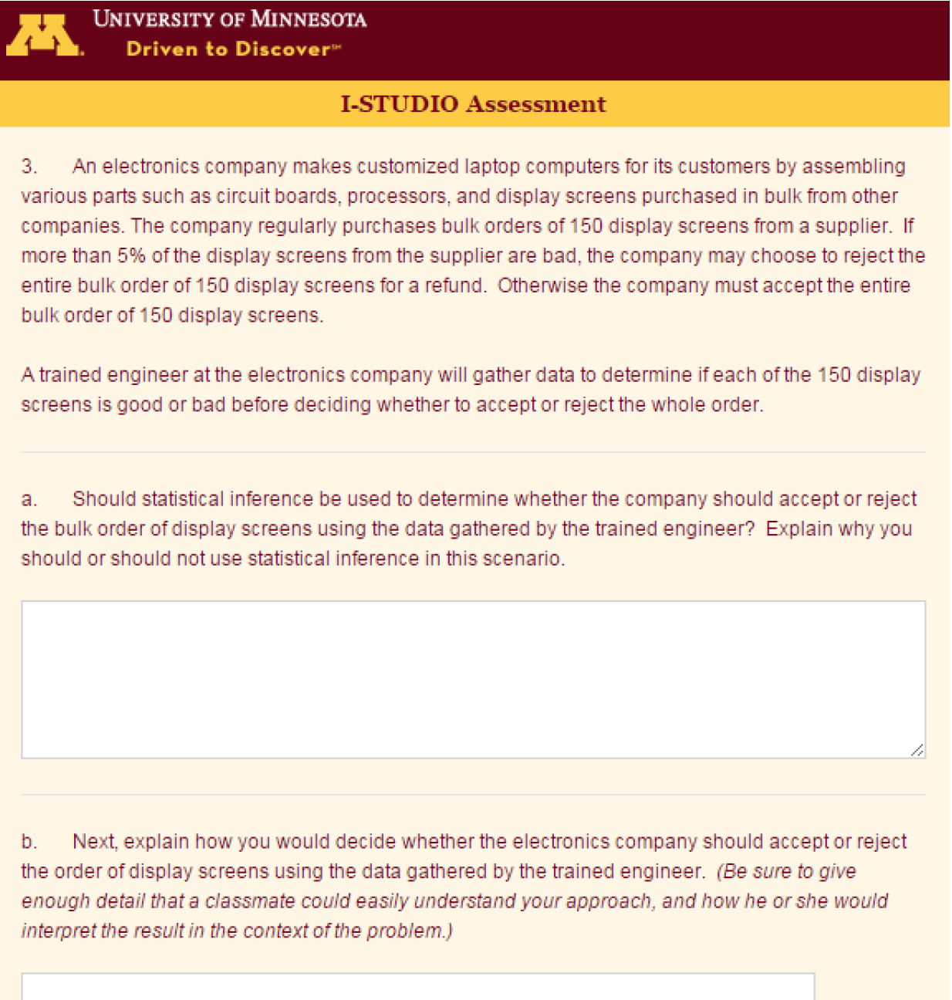
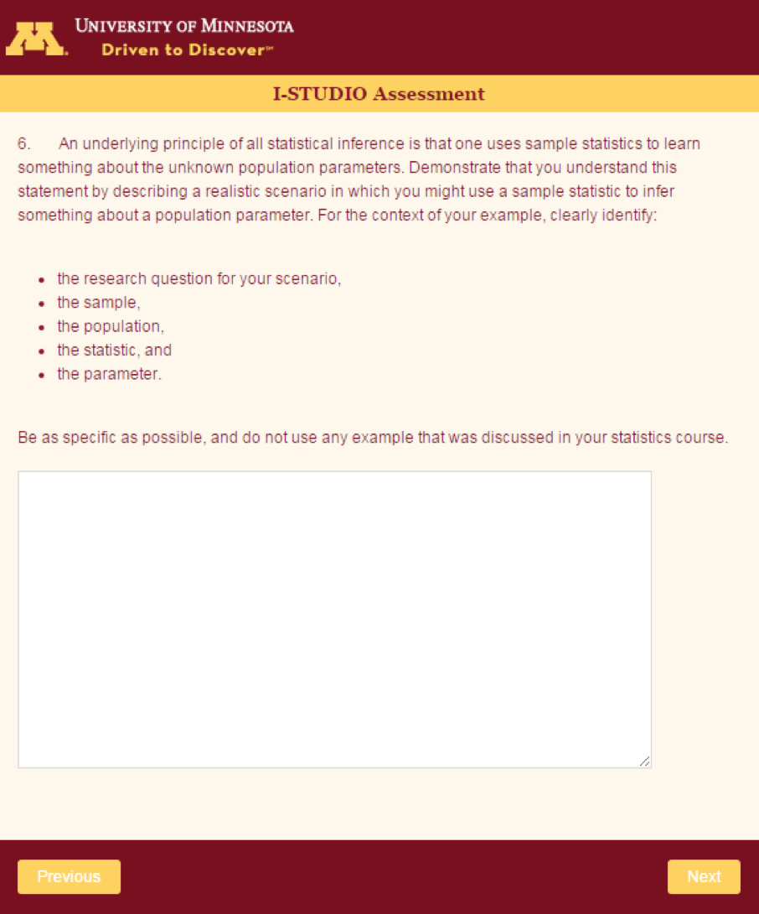

## Front Matter

#### Terms

- *Cognitive transfer* has been used in the learning literature to describe the degree to which knowledge can be successfully applied to new or novel situations (e.g., Singley & Anderson, 1989)

- Introductory Statistics Understanding and Discernment Outcomes (ISTUDIO) Assessment

#### Goals for the session

0. Introduce ISTUDIO Assessment
1. What was ISTUDIO designed to measure? 
2. One slide outline of the study
3. **What we learn when asking questions like this?**

## What was ISTUDIO designed to measure?

- Discernment of statistical questions
    - this evaluation is the first step to productive analysis
    - Problem phase in "PPDAC" cycle (Wild & Pfannkuch, 1999)
    - Difference between deterministic and stochastic inquiry (Franklin & Garfield, 2006)

- Statistical thinking
    - Statistical thinking manifests as "shuttling" between problem context and architypical models (Wild & Pfannkuch 1999)
    - ISTUDIO attempts to isolate each direction in the shuttling process
        - context to architype 
        - architype to context

## Brief outline of study 

- Sample
    - 1975 student participants; 1935 consented to research; 1566 usable responses
    - 29 class sections for 16 unique classes at 15 different institutions
    - Analysis based on a representative random sample of $n = 178$
- ISTUDIO assessment tool
    - 7 open-ended tasks, each with two or more parts
    - Inference is appropriate for some, but NOT all questions.
    - Respond as if giving advice/instructions to a classmate.
    - Provide enough detail that a classmate could easily carry out your instructions, and explain how he or she should interpret the result within the context of the problem.
    - Calculations are NOT required.
- Scoring rubrics
    - Curriculum agnostic
    - Every task has a detailed rubric with real student examplars
    - Rubric development and analysis available in Beckman (2015)
- Reliability & validity analysis reported in Beckman (2015)

## What do we learn when asking questions like this?

Let's look at a few of the ISTUDIO tasks as well as some actual student responses...

## Task Description: Note Identification task 

Item credit: Garfield, J., delMas, R., & Zieffler, A. (2012)

#### Key details

- Some people who have a "good ear for music" can identify the notes they hear when music is played.
- A music teacher choosing and playing a note at random on the piano.  
- The student names which note was played without looking.
- **Suppose you want to determine whether a student named Carla has a “good ear for music” using this method of note identification.**

#### Prompts

- Should statistical inference be used?  Explain. 

- Explain how you would decide whether Carla has a good ear for music using this method of note identification.  

## Selected responses to the Note Identification task

1. "Since statistical inferences measure population it would not be a good idea to use this in the case of carla because it is measuring the accuracy of her note identification skills, not measuring a population." (Student 1038)

 

2. "No, I don't think so because you are not comparing her data to anyone else's data or to an overall population." (Student 1006)

## Observation: Population as a process

- 35 of the 178 students ($\approx 20\%$) said that statistical inference was **NOT** valid because Carla is a single person
    - Some students constructed some kind of artificial discrete/countable population 
    - They frequently cited that her result could not represent a population **of other people**
- For example: 
    - "I would sample at least less then 10% of the overall population but not just one person." (Student 780)
    - "I would test a population of people on whether they have a good ear for music and then compare the students score compared to the rest of the population." (Student 1550)

## Task Description: Rossman-Chance Task

Item credit: Rossman & Chance (2001)

### Prompt

An underlying principle of all statistical inference is that one uses sample statistics to learn something about the unknown population parameters. Demonstrate that you understand this statement by describing a realistic scenario in which you might use a sample statistic to infer something about a population parameter. For the context of your example, clearly identify:

-	the research question for your scenario,
-	the sample, 
-	the population, 
-	the statistic, and 
-	the parameter. 

Be as specific as possible, and do not use any example that was discussed in your statistics course.

## Responses to Rossman-Chance Task (emphasis added)
\scriptsize

1. **Student 1486**: Question:  Is facebook a popular social networking site among college students?  The *sample* will be 100 randomly selected students from 5 American campuses (500 students total).  The *population* will be college students.  The *statistic* will be whether or not they use facebook and the *parameter* will be yes or no.

 

2. **Student 1550**: Is there a major difference in test scores of males verse females on their ACT scores? The *sample* is random sample of 500 juniors in [the state]. 250 males. 250 females. *Population*: all juniors in [the state]. *Statistic*: 500 *parameter*: all juniors in [the state].

 

3. **Student 1459**: If you would like to figure out the average height of men aged from 20-35?   *Population*: Everyone in that age range *Sample*: selections made from the population   *Statistic*: The height from the men *Parameter*: The people who are getting tested

## Observation: Lexical ambiguity/misconceptions of parameter

- Students showed a great deal of variability among concepts ascribed to key foundations of inferential statistics
- The task is unique in that it permits students to use a context of their own invention/choosing
- The **parameter** seemed particularly challenging for students, to which they ascribed a variety of concepts (e.g., a variable, a study constraint, a population).

## Task Description: Display Screen Quality

#### Key details

- An electronics company makes customized laptop computers for its customers by assembling various parts purchased in bulk from other companies. 
- The company purchases bulk orders of 150 display screens from a supplier.  
- If more than 5% of the display screens are bad, the company may reject the entire bulk order for a refund. 
- **A trained engineer [will] determine if each of the 150 display screens is good or bad before deciding whether to accept or reject the whole order.**  

#### Prompts

- Should statistical inference be used?  Explain. 

- Explain how you would decide whether the electronics company should accept or reject the order of display screens using the data gathered by the trained engineer.

## Selected responses to the Display Screens task

#. Student 719
    - *Inference?* "Yes, statistical inference should be used... we can find the margin of error and a confidence percentage that will lead us to accept or reject the bulk order. "
    - *Method?* "If 5% of the display screens from the supplier are bad, then that means 92.5 or more of them have to be good in order to accept them."

#. Student 122
    - *Inference?* "Statistical inference should be used because the sample is random every time."
    - *Method?* "You would have the trained engineer check each screen and if 8 or more of the screens were bad, send the order back."

## Observation: Discerning between deterministic and stochastic inquiry

- The pattern of self-contradiction is particularly of interest here.

- 32 of the 178 students ($\approx 18\%$) incorrectly claim statistical inference **IS** valid for the Display Screens task, BUT then described a **deterministic** solution.

- The converse was regularly observed in the note identification task.  Several students incorrectly claimed statistical inference was **NOT** valid, and then propose an **inferential** solution.

## Additional examples (deterministic/stochastic inquiry)

In the Note Identification task, a stochastic inquiry, we see the converse issue

#. Student 1541
    - *Inference?* "No statistical inference should not be used..."
    - *Method?* "You can use hypothesis testing to conclude a result. (1.) Determine the null and alternative hypothesis (2.) Find the p-value  (3.) Decide if the result is statistically significant (4.) Make a conclusion"

#. Student 1293
    - *Inference?* "Statistical inference should not be used to determine if Carla has a good ear for music or not because the sample size is too small and may not give any usable data."
    - *Method?* "The best way to decide if Carla has an ear for music would be to run a significance test with a confidence interval of 95%."

## Conclusions 
\small

1. Population as a process: 
    - finding: some students uncomfortable with a process as population
    - finding: some students unnecessarily imposed a more tangible population
    - illustrates a key challenge while "shuttling" from context to archetype described by Wild & Pfannkuch (1999)
2. Lexical ambiguity/misconceptions of parameter
    - finding: large variability of concepts ascribed to parameter
    - B. & delMas (in review) launched an extensive follow-up study of this issue and corroborated concurrent work of Kaplan & Rogness (2018).
    - evidence of difficulty "shuttling" from archetype to context described by Wild & Pfannkuch (1999)
3. Deterministic vs stochastic inquiry (i.e. Is this a statistical question?)
    - finding: students self-contradict... they advocate for one approach and then describe the opposite
    - evidence of difficulty discerning between deterministic and stochastic inquiry described by Franklin & Garfield (2006)

## What do you learn when you ask questions like this?

- We test our students' reflexes (Chance, 2002)
- Opportunities to distinguish between deterministic and stochastic inquiry
- Isolate each direction of "shuttling" as statistical thinking takes place
- Better insight into understanding & misconceptions of our students

## References 

\scriptsize

#. Beckman, M. D. (2015). *Assessment of cognitive transfer outcomes for students of introductory statistics* (Doctoral dissertation, University of Minnesota—Twin Cities). Retrieved from http://iase-web.org/documents/dissertations/15.MatthewBeckman.Dissertation.pdf

#. Beckman, M. D., delMas, R. C. (in review). Statistics students' identification of inferential model elements within contexts of their own invention. 

#. Ben-Zvi, D., & Garfield, J. (2005). Statistical literacy, reasoning, and thinking: Goals, definitions, and challenges. *The challenge of developing statistical literacy, reasoning and thinking* (pp. 3-15) Springer.

#. Chance, B. (2002). Components of statistical thinking and implications for instruction and assessment. *Journal of Statistics Education, 10*(3).

#. Franklin, C. A., & Garfield, J. B. (2006). The GAISE Project. Developing statistics education guidelines for grades pre-K-12 and college courses. In G. F Burrill & P. C. Elliot (Eds.), *Thinking and reasoning with data and chance* (pp. 345-375). Reston, VA: National Council of Teachers of Mathematics.

#. Garfield, J., delMas, R., & Zieffler, A. (2012). Developing statistical modelers and thinkers in an introductory, tertiary-level statistics course. *ZDM Mathematics Education, 44*(7), 883-898.

#. Kaplan, J.J. & Rogness, N. (2018). Increasing statistical literacy by exploiting lexical ambiguity of technical terms. *Numeracy, 18*(1). 

#. Rossman, A. J., & Chance, B. L. (2001). Workshop statistics: Discovery with data (2nd ed.). Emeryville, CA: Key College Publishing.

#. Singley, M. K., & Anderson, J. (1989). *The transfer of cognitive skill.* Cambridge, MA: Harvard.

#. Wild, C.J. & Pfannkuch, M. (1999). Statistical Thinking in Empirical Enquiry. *International Statistical Review, 67*(3), 223-265. 

## Backup Slides

## Note Identification Task

## Display Screen Quality

## Rossman Chance Task

